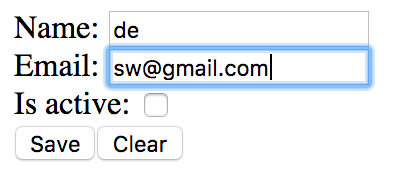

In this tutorial we will learn the state management and two-way data binding basics on the example of the simple user info editing form.



Our form will be the simple stateful component holding the state of the form in its local state, and for the purpose of the illustration storing its state in the browser's localStorage.

# Defining the stateful component

React-MVx extends React namespace and must be used instead of React. The most important class it exports is the modified `Component`.

The general definition of the stateful component looks like this:

```javascript
import React, { define } from 'react-mvx'
import ReactDOM from 'react-dom'

@define class Application extends React.Component {
    static state = {
        /* state attributes definition */
    };

    render(){
        return (
            /* jsx */
        );
    }
}

ReactDOM.render( <Application/>, document.getElementById( 'react-application' ) );
```

There are few differences to raw React so far:

- Component definitions (as all React-MVx definitions) must be preceded with the `@define` decorator. 
- The state is not _assigned_ in the constructor, but _declaratively defined_ in class definition.

# Declaring the state

In the simplest case like ours when the state is flat and consists of primitive types, the state definition looks like the plain object. We list state attributes accompanied with their default values.

```javascript
    static state = {
        name : '',
        email : '',
        isActive : true
    };
```

This declaration will lead to an automatic creation of the observable `component.state` object of the similar shape when the `Application` component will be mounted. No need to initialize the state in the constructor.

No need for `component.setState()` either; plain assignments to the `component.state` members will be detected and will lead to the component's render. Which is cute, but we won't need any explicit state modifications in this example. Because we have two-way data binding.

# Adding the form's markup

Now it's the time to create the markup for our form using the standard React's ["controlled components"](https://facebook.github.io/react/docs/forms.html#controlled-components). Controlled components do not have their own local state; it's mapped to some external state container.

In React-MVx this mapping is done with _links_. Think of [link](../04_Link/00_Overview.md) in this example as an object-reference to the state's attribute. `link.props` return the `value`/`onChange` props pair which is expected by standard _controlled form components_.

```javascript
    render(){
        // Link the state...
        const { name, email, isActive } = this.linkAll();

        return (
            <form>
                <label>
                    Name: <input type="text" { ...name.props }/>
                </label>

                <label>
                    Email: <input type="text" { ...email.props }/>
                </label>

                <label>
                    Is active: <input type="checkbox" { ...isActive.props }/>
                </label>
            </form>
        );
    }
```

At this stage, we have an editable form.

# Adding the persistent state

We would like to store the state of our form in the browser's localStorage. "Save" button must save the state, while "Cancel" must return the form to its default state. First of all, lets add these buttons:

```javascript
    render(){
        ...
        return (
            <form onSubmit={ this.onSubmit }>
                ...
                <button type="submit">Save</button>
                <button type="button" onClick={ this.onCancel }>
                    Clear
                </button>
            </form>
        );
    }
```

We want "Cancel" button to set out state to its defaults, which is represented in the code quite literally:

```javascript
    onCancel = () => this.state.set( this.state.defaults() );
``` 

And the "Save" button must save the state to the localStorage. Good news is that _all the state in React-MVx is serializable by default_.

```javascript
    onSubmit = () => localStorage.setItem( 'users-form', JSON.stringify( this.state ) );
```

Now, all we have to do is to restore the state on load. Which is done in the standard React's `componentWillMount` lifecycle hook.

```javascript
    componentWillMount(){
        const json = JSON.parse( localStorage.getItem( 'users-form' ) || '{}' );
        this.state.set( json, { parse : true } );
    }
```

That's really it. Here are the complete [sources](https://github.com/gaperton/react-mvx-examples/blob/master/src/form.jsx) of our example, and here you can see the example [working](https://gaperton.github.io/react-mvx-examples/dist/form.html).

# API used in the example

### `static` state = { attrName : `attrDef`, ... }
### component.state

Local [component's](../02_Component/00_Overview.md) [state](../02_Component/02_state.md).

### record.set( data, options? )

Component's state is actually modeled with the Type-R's [Record](https://volicon.github.io/Type-R/Record/Overview.html). [record.set()](https://volicon.github.io/Type-R/Record/Updates_and_transactions.html) method is used to bulk update the state, `{ parse : true }` option means that `data` is the raw JSON and needs to be processed accordingly.

### record.toJSON()

This method was implicitly called in `JSON.stringify( this.state ) );`. There are more details on Type-R serialization in its [docs](https://volicon.github.io/Type-R/API_by_feature/Serialization.html).

### component.linkAll()

Method is used to [create the links](../04_Link/02_Create_the_link.md) for the state attributes. Read more about [links](../04_Link/00_Overview.md) in docs.

### link.props

[Transforms](../04_Link/03_Link_transformations.md) the link to the controlled component's `value`/`onChange` props pair. Read more about data binding in [docs](../05_Data-bound_controls.md).